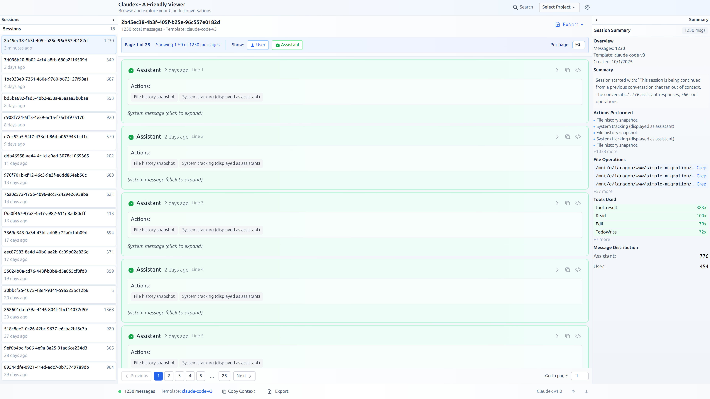
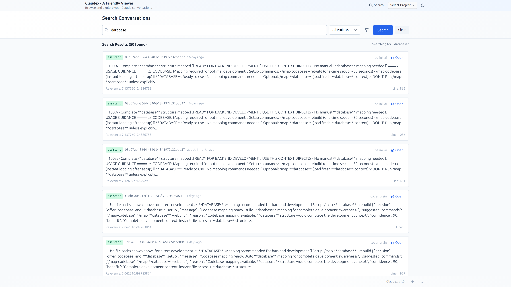

<div align="center">
  

  # Claudex

  **A powerful web application for viewing, searching, and analyzing Claude Code conversation histories.**

  Features universal template support (V1.x, V2-mixed, V2.0+), full-text search with SQLite FTS5, and a modern React UI.

  [](https://github.com/kunwar-shah/claudex/releases)
  [](LICENSE)
  [](https://kunwar-shah.github.io/claudex/)

  **📚 [View Full Documentation](https://kunwar-shah.github.io/claudex/)** | **🌐 [Live Site](https://kunwar-shah.github.io/claudex/)**

</div>

## 📸 Screenshots

### Home & Conversation View


### Full-Text Search


## ✨ Features

- 📁 **Auto Project Discovery**: Scans `~/.claude/projects` for all conversations
- 🔍 **Full-Text Search**: SQLite FTS5-powered search across all messages with filters
- 📝 **Universal Template Support**: Works with all Claude Code versions (V1.x, V2-mixed, V2.0+)
- 🎯 **Smart Rendering**: Markdown, code blocks, diffs, JSON, tool usage visualization
- 📊 **Session Analytics**: Message distribution, file operations, conversation stats
- 📋 **Export Options**: JSON, HTML, and TXT formats for conversations
- 🎨 **Modern UI**: Responsive design with fixed header/footer and smooth navigation
- 🚀 **Hot Reload**: Development mode with auto-restart on code changes

## 🚀 Quick Start

### Prerequisites

- Node.js 18+ and npm
- Claude Code installed with conversation history in `~/.claude/projects`

### Installation

1. **Clone the repository**:
```bash
git clone https://github.com/kunwar-shah/claudex.git
cd claudex
```

2. **Run system check** (optional but recommended):
```bash
npm run check
```
This validates your environment and catches common setup issues.

3. **Install dependencies** (or use auto-fix):
```bash
# Option 1: Manual installation
npm install
cd server && npm install && cd ..
cd client && npm install && cd ..

# Option 2: Auto-fix (installs deps + creates .env)
npm run check:fix
```

4. **Configure environment** (if not using auto-fix):
```bash
cd server
cp .env.example .env
# Edit .env if needed (default: PROJECT_ROOT=~/.claude/projects)
cd ..
```

5. **Start the application**:
```bash
# Automatically runs system check, then starts servers
npm run dev
```

6. **Open your browser**: http://localhost:3000

The backend API runs on `http://localhost:3400`

### System Checker

Claudex includes a comprehensive system checker that validates your environment:

```bash
# Quick check
npm run check

# Detailed output
npm run check:verbose

# Auto-fix common issues
npm run check:fix

# JSON output (for CI/CD)
npm run check:json
```

**What it checks:**
- ✅ Node.js & npm versions
- ✅ PROJECT_ROOT path & permissions
- ✅ Port availability (3000, 3400)
- ✅ Dependencies installation
- ✅ Claude Code data (projects, sessions)
- ✅ JSONL file validity
- ✅ Database permissions
- ✅ Search index status

### Global CLI Installation (Optional)

Install globally to use `claudex` command anywhere:

```bash
./install.sh

# Then run from anywhere:
claudex
```

## 🔧 Configuration

### Server Configuration (`.env`)

```env
# Path to Claude Code projects directory
# Supports ~ expansion (e.g., ~/.claude/projects)
PROJECT_ROOT=~/.claude/projects

# Server port
PORT=3400

# Environment
NODE_ENV=development
```

### Default Ports

- **Frontend**: http://localhost:3000 (Vite dev server)
- **Backend**: http://localhost:3400 (Fastify API)
- **Frontend build**: Uses port 3400 (served by backend in production)

## 📂 Project Structure

```
claudex/
├── server/                    # Backend (Node.js + Fastify)
│   ├── src/
│   │   ├── parsers/          # Template detection & message parsing
│   │   │   ├── templateDetector.js    # V1/V2/V3 template detection
│   │   │   └── messageParser.js       # Universal message parser
│   │   ├── services/         # Core business logic
│   │   │   ├── fileScanner.js        # Project/session discovery
│   │   │   ├── sessionParser.js      # Full session parsing
│   │   │   ├── searchDatabase.js     # SQLite FTS5 search
│   │   │   └── searchIndexer.js      # Search index builder
│   │   ├── routes/           # API endpoints
│   │   │   ├── projects.js           # Project/session routes
│   │   │   ├── search.js             # Search routes
│   │   │   └── export.js             # Export routes
│   │   ├── utils/            # Helper utilities
│   │   │   └── pathHelper.js         # Path expansion (~/ support)
│   │   └── server.js         # Main server
│   ├── data/                 # SQLite database (auto-created)
│   ├── .env.example          # Environment template
│   └── package.json
├── client/                   # Frontend (React + Vite)
│   ├── src/
│   │   ├── components/       # React components
│   │   │   ├── ProjectSelector.jsx
│   │   │   ├── SessionList.jsx
│   │   │   ├── ConversationThread.jsx
│   │   │   ├── MessageBubble.jsx
│   │   │   ├── ClaudeMessageRenderer.jsx
│   │   │   └── SearchPage.jsx
│   │   ├── services/         # API client
│   │   │   └── api.js
│   │   └── App.jsx           # Main app
│   └── package.json
├── bin/                      # CLI entry point
├── test-search.sh           # Search API testing script
├── install.sh               # Global CLI installer
├── SETUP.md                 # Detailed setup guide
├── README.md                # This file
└── package.json             # Root package (CLI + concurrently)
```

## 🎯 Supported Claude Code Formats

The viewer automatically detects and parses all Claude Code conversation formats:

### V3 Template (Universal - Recommended)
- **Claude Code v2.0+**: New format with `role` field directly
- **Claude Code v1.x**: Original format with `type` field
- **Edge cases**: Mixed formats and migration states
- **New message types**: `file-history-snapshot` support
- **Role mapping**: All system messages → assistant (binary user/assistant classification)

### Legacy Templates (Auto-detected)
- **V2-Mixed**: Transition format between V1 and V2
- **V1**: Original Claude Code format

The template detector uses a waterfall detection strategy, automatically selecting the best parser for your conversation files.

## 🔍 Search System

### Building the Search Index

The search index needs to be built before searching:

```bash
# Option 1: Via API
curl -X POST http://localhost:3400/api/search/index/build

# Option 2: Via test script
./test-search.sh

# Option 3: Via UI (Search page → "Rebuild Index" button)
```

### When to Rebuild Index

Rebuild the search index when:
- First time setup
- After template changes
- When new conversations are added
- If search results seem outdated

### Search API Examples

```bash
# Basic search
curl -X POST http://localhost:3400/api/search \
  -H "Content-Type: application/json" \
  -d '{"q": "migration", "limit": 10}'

# Search with filters
curl -X POST http://localhost:3400/api/search \
  -H "Content-Type: application/json" \
  -d '{
    "q": "database",
    "projectId": "my-project",
    "role": "user",
    "limit": 20,
    "offset": 0
  }'

# Check index status
curl http://localhost:3400/api/search/index/status
```

## 📡 API Endpoints

### Projects & Sessions
| Endpoint | Method | Description |
|----------|--------|-------------|
| `/api/projects` | GET | List all projects |
| `/api/projects/:id/sessions` | GET | Get sessions for project |
| `/api/projects/:id/sessions/:sessionId` | GET | Get full session with messages |

### Search
| Endpoint | Method | Description |
|----------|--------|-------------|
| `/api/search` | POST | Search conversations (FTS5) |
| `/api/search/index/build` | POST | Build/rebuild search index |
| `/api/search/index/status` | GET | Get index statistics |
| `/api/search/index/clear` | POST | Clear search index |

### Export
| Endpoint | Method | Description |
|----------|--------|-------------|
| `/api/export/session/:projectId/:sessionId?format=json` | GET | Export as JSON |
| `/api/export/session/:projectId/:sessionId?format=html` | GET | Export as HTML |
| `/api/export/session/:projectId/:sessionId?format=txt` | GET | Export as TXT |

### Health
| Endpoint | Method | Description |
|----------|--------|-------------|
| `/api/health` | GET | Health check + system info |

## 🛠️ Development

### Development Mode

```bash
# Run both frontend + backend with hot reload
npm run dev

# Or run separately:
# Terminal 1 - Backend (auto-restarts on changes)
cd server && npm run dev

# Terminal 2 - Frontend (hot module replacement)
cd client && npm run dev
```

### Testing the Search System

```bash
# Run comprehensive search tests
./test-search.sh
```

This script will:
1. Check server health
2. Get index status
3. Build/rebuild index
4. Run test searches with various filters
5. Display results

### Adding New Templates

1. **Update Template Detector** (`server/src/parsers/templateDetector.js`):
```javascript
'my-template': {
  name: 'My Template Name',
  detect: (samples) => {
    return samples.some(s => s.myUniqueField !== undefined);
  },
  parser: 'my-template'
}
```

2. **Add Parser Method** (`server/src/parsers/messageParser.js`):
```javascript
parseMyTemplate(rawMessage) {
  return {
    id: rawMessage.id || this.generateId(),
    role: rawMessage.myRole === 'user' ? 'user' : 'assistant',
    content: rawMessage.myContent || '',
    timestamp: rawMessage.myTimestamp,
    // ... other fields
  };
}
```

3. **Rebuild Search Index**: The new template will be automatically detected and used.

## 📝 Scripts Reference

### Claudex Directory
- `npm run dev` - Run frontend + backend concurrently (with pre-check)
- `npm start` - Run frontend + backend (production mode)
- `npm run check` - Run system health check
- `npm run check:verbose` - Run detailed system check
- `npm run check:fix` - Auto-fix common setup issues
- `npm run check:json` - JSON output for CI/CD
- `./install.sh` - Install as global CLI command
- `./test-search.sh` - Test search API endpoints

### Server Directory
- `npm run dev` - Run with nodemon (auto-restart)
- `npm start` - Run in production mode

### Client Directory
- `npm run dev` - Vite dev server (http://localhost:3000)
- `npm run build` - Build for production
- `npm run preview` - Preview production build

## 🐛 Troubleshooting

### Quick Diagnosis

Run the system checker first to identify issues:
```bash
npm run check:verbose
```

This will check all common problems and provide actionable suggestions.

### Common Issues

#### No Projects Found
```bash
# Check what the system sees
npm run check

# Verify path
cat server/.env | grep PROJECT_ROOT
```
- Verify `PROJECT_ROOT` in `.env` points to `~/.claude/projects`
- Check that Claude Code has created conversation files
- Run `npm run check:fix` to auto-create missing directories

#### Search Not Working
```bash
# Quick fix via UI
# Visit http://localhost:3000/search → Click "Rebuild Index"

# Or via command line
curl -X POST http://localhost:3400/api/search/index/build
```

#### Port Conflicts
```bash
# System checker will detect port conflicts
npm run check

# Auto-detected ports in use show PID
# Kill process: kill <PID>
# Or change PORT in server/.env
```

#### Permission Errors
```bash
# Check permissions
npm run check:verbose

# Fix permissions
chmod +r ~/.claude/projects
chmod +w claude-viewer/server/data
```

#### Dependencies Issues
```bash
# Auto-install all dependencies
npm run check:fix
```

## 🚢 Production Deployment

### Using Docker (Coming Soon)

```bash
docker-compose up -d
```

### Manual Production Build

```bash
# Build client
cd client && npm run build

# Start server (serves built client)
cd ../server && NODE_ENV=production npm start
```

Access at: http://localhost:3400

## 📋 Roadmap

- [x] SQLite FTS5 full-text search
- [x] Universal template support (V1/V2/V3)
- [x] Export to JSON/HTML/TXT
- [x] Path portability with `~/` support
- [x] Hot reload development mode
- [ ] Docker deployment
- [ ] WebSocket live updates
- [ ] Authentication for multi-user
- [ ] Conversation analytics dashboard
- [ ] Plugin system for custom parsers
- [ ] Diff viewer for file changes

## 📄 License

MIT License - see LICENSE file for details.

## 🤝 Contributing

1. Fork the repository
2. Create a feature branch: `git checkout -b feature/amazing-feature`
3. Commit changes: `git commit -m 'Add amazing feature'`
4. Push to branch: `git push origin feature/amazing-feature`
5. Open a Pull Request

## 📚 Additional Documentation

- [SETUP.md](SETUP.md) - Detailed setup and configuration guide
- [INSTALL.md](INSTALL.md) - Legacy installation instructions

## 💡 Tips

- Use the search page to find conversations across all projects
- Export conversations to share with team members
- Rebuild search index after adding new conversations
- Check `/api/health` endpoint to verify system status
- Use `npm run dev` for the best development experience with hot reload
